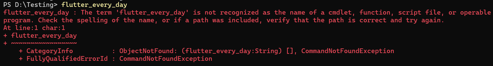

# FlutterEveryDay CLI

A custom, cross-platform Command Line Interface (CLI) built to manage, download, and explore daily Flutter mini-apps. 

Instead of creating a massive repository filled with redundant, heavy native folders (`android`, `ios`, `windows`), this tool uses optimized **Git sparse-checkouts** to pull only the specific Dart code you want. It then dynamically generates the native platform files locally via a hidden shell, ensuring your machine stays clean and your projects compile perfectly on any operating system.

## Mini-Apps

* **Day 01: GitHub Viewer**
  A data-fetching application that utilizes the `http` package to interact with web APIs and display external data.
* **Day 02: Hive Database** *(Coming Soon)*
  An exploration into local, offline storage using the `hive` NoSQL database for rapid data persistence.

## 🛠️ How to Use

You don't need to manually clone this repository. You can install the CLI wizard globally using Dart.

**1. Install the CLI tool:**
Run this command in your terminal to activate the tool directly from GitHub:
```bash
dart pub global activate --source git https://github.com/VineetHegde/FlutterEveryDay
```

**2. Run the Wizard:**
Navigate to the folder where you want to build your app, and simply type:
```bash
flutter_every_day
```
An interactive arrow-key menu will appear. Select your desired app, and the CLI will handle the downloading and native file generation automatically!

## 🔄 How to Update

As new mini-apps are added to the repository, you can update your local CLI tool to get the latest menu by simply running the activation command again:

```bash
dart pub global activate --source git [https://github.com/VineetHegde/FlutterEveryDay](https://github.com/VineetHegde/FlutterEveryDay)
```

## ⚠️ Troubleshooting

**Error: "The term 'flutter_every_day' is not recognized"**
If you see this error after installing, it means Dart's global executable folder is not in your system's PATH.

* **The Quick Fix:** You can bypass the PATH issue and run the tool directly through Dart by typing: 
  `dart pub global run flutter_every_day`
* **The Permanent Fix (Windows):** 
  1. Open Windows Search and type **"Environment Variables"**.
  2. Edit your User variables and find the variable named **`Path`**.
  3. Click **Edit**, then **New**, and add your Dart pub cache bin folder (usually `C:\Users\YOUR_USER\AppData\Local\Pub\Cache\bin` or `V:\src\pub_cache\bin`).
  4. **Restart your terminal** and try typing `flutter_every_day` again.



## 🏗️ Project Architecture

This repository operates as a "Monorepo." The root folder acts as the CLI tool engine, while the mini-apps are completely isolated to prevent dependency conflicts.

```text
FlutterEveryDay/
├── bin/
│   └── flutter_every_day.dart    <-- The Engine: Cross-platform CLI script
├── pubspec.yaml                  <-- ROOT PUBSPEC: Only contains CLI dependencies
│
└── mini_apps/                    <-- The Payload: Isolated application code
    │
    ├── day01_github_viewer/
    │   ├── lib/
    │   │   └── main.dart         <-- Day 01 Dart code
    │   └── pubspec.yaml          <-- DAY 01 PUBSPEC: Only has Flutter & http
    │
    └── day02_hive_db/
        ├── lib/
        │   └── main.dart         <-- Day 02 Dart code
        └── pubspec.yaml          <-- DAY 02 PUBSPEC: Only has Flutter & hive

```
# Created with ❤️ by Vineet.
